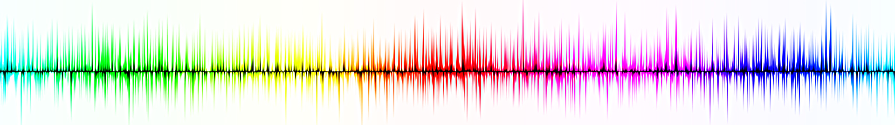

# MIT 6.S191 Lab 1: Intro to TensorFlow and Music Generation with RNNs

## Part 1: Intro to TensorFlow

Introduction to TensorFlow.

## Part 2: Music Generation with RNNs

Building a Recurrent Neural Network(RNN) for Music Generation. We will be using a "Character RNN" to predict the next character of sheet music in "ABC notation". We will test the model by creating brand new music.

