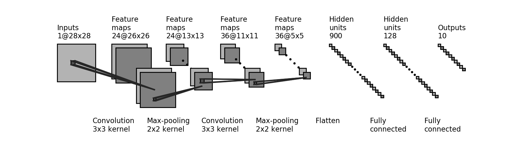
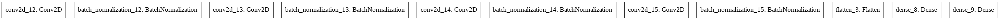
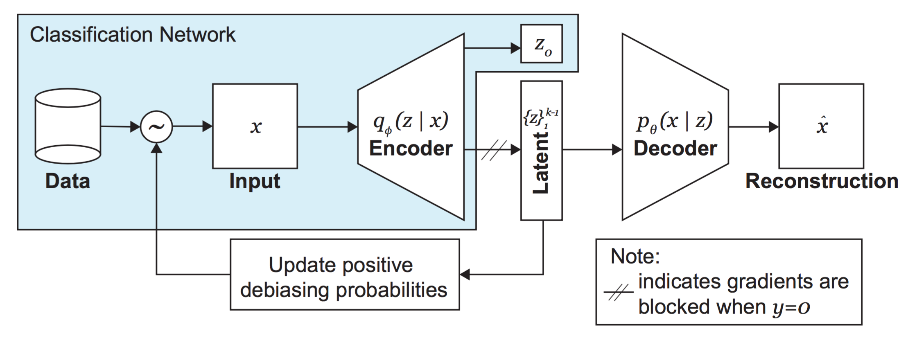

# MIT 6.S191 Lab 2: Computer Vision

## Part 1: MNIST Digit Classification
MNIST Digit Classification using Neural Networks and Convolutional Neural Networks.

### CNN Architecture

## Part 2: Debiasing Facial Detection Systems
**Facial Detection** and **Algorithmic Bias** are two prominent aspects of Applied Deep Learning. We will create a **Debiasing Variational Auto-Encoder** for Face Detection reducing the Algorithmic Bias in **Standard Convolutional Neural Networks(CNN)**.

Research Paper: [AAAI_MitigatingAlgorithmicBias](http://introtodeeplearning.com/AAAI_MitigatingAlgorithmicBias.pdf)

### Standaed Convolutional Neural Network

### Variational Auto-Encoder

### Debiasing Variational Auto-Encoder

### Face Time GIF

